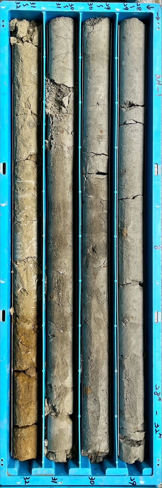

# 利用中央地質調查所於全台鑽井影像進行語意分割模型預測岩性類別

## 使用U-Net、SegNet和FCN等語意分割模型對岩心盒進行像素級別的岩性預測

<div style="text-align:center;">
     
</div>

1. **環境建置**
    ```sh
    pip install -r requirements.txt
    ```

2. **重分類岩性標籤**<br>使用`0_reclassify_original_labels.ipynb`根據需求將岩心盒的13種岩性分類重新歸類為2、3或4類。

3. **分割測試資料集**<br>使用`1_split_out_testing_dataset.ipynb`將測試資料集分離出來，避免其用於訓練和驗證。

4. **模型訓練**<br>使用`2_model_training.ipynb`開始訓練模型。